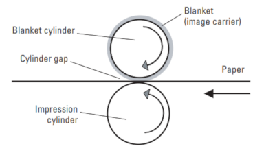
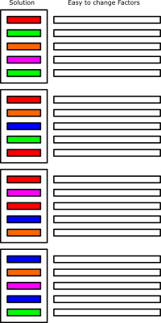

```{r setup, include = FALSE}
knitr::opts_chunk$set(
  collapse = TRUE,
  comment = "#>",
  echo=TRUE,
  message = FALSE,
  warning = FALSE
)

library(rospd)
library(knitr)
library(ggpubr)
```

# Abstract

# Introduction

<!--
- Importance of split plot designs
- Less restrictive split plot designs
- Structure of the paper:
  1. Example and Split Plots, Definitions and models
  2. Less restricitive design problem: semi hard to change <<- BETTER NAME?
  3. Description of the algorithm
  4. Package Documentation & Example
  5. Conclusion and future work
--> 

# Restricted Randomization in Split-Plot Designs

When applying design of experiments (DoE) in the real world it is often difficult to follow one of the core concepts of DoE: Randomization. In a completely randomized design treatments (combinations of factor levels) are performed in complete random order to avoid bias in the analysis due to uncontrolled factors. In many applications following this idea is a problem. Often there are restrictions to the experimental setup that make a complete randomized design extremely expensive or inconvenient at best. 

Kowalski @kowalski:recsplitplot discusses a nice example for this problem. When trying to optimize the quality of a printing process there are three factors to look at:

- **Blanket Type:** Two possibles types of blankets for the printing press.
- **Cylinder Gap:** The distance between the two cylinders of the printing press.
- **Press Speed:** The speed of the printing press.



It is fairly simple to change the *Cyliner Gap* or *Press Speed* from one experiment to the next one, as these factors can be reset during the printing process. Exchanging the *Blanket Type* though is much more work. It requires the printing press to be stopped before the old blanket can be removed and the new one can be put on the press. Thus a completely randomized design, like the following one, is very time intensive as it involves exchanging the blanket quite often.

```{r crd_printing_press, echo=FALSE, message=FALSE, warning=FALSE}

  load(file="designs/introcrd.rda")
  kable(intro.crd[[1]]@design.table, caption= "Completely Randomized Design")

```

The reader should be aware that the operator is expected to exchange the blanket after each run even if consecutive runs are using the same type of blanket. The rationale behind that is, that ordinary least squares regression - that is typically used to analyze DoE-data - assumes independence of observations. Using the same blanket for multiple runs would violate this assumption as the experiments done with the same blanket would be correlated with each other.

Fisher @Fisher1992 first wrote about that problem and gave a solution with **Split Plot Designs**. A split plot design allows a restricted randomization. For the current example this means that it is no longer necessary to exchange the blanket for each experiment. Instead the same blanket can be used inside of each **whole plot**. 

```{r sp_printing_press, echo=FALSE, message=FALSE, warning=FALSE}
 
  load(file="designs/introsplitplot.rda")

  kable(cbind( Whole_Plots = as.character(c(1,1,2,2,3,3,4,4)),intro.splitplot[[1]]@design.table), caption="Split Plot Design")
```

In this example the factor **blanket type** would be called a **hard-to-change**-factor (HTC). It is inconvenient to reset this factor for each experiment and thus a restriction to the randomiztion of the experiment is imposed. The restriction limits the number of resets of the hard-to-change factor to a practical amount. 

In contrast to the hard-to-change-factor, all other factors - that can be reset for each experiment without a lot of effort - are called **easy-to-change**-factors (ETC). A split plot design is still randomized inside of the whole plots so that the easy-to-change-factors are changing as much as possible. 

There are many forms of split plot designs or rather of hard-to-change factors. Jones @jones:whyandhow @jones:book and Kowalski @kowalski:recsplitplot give some nice examples on this topic.

Using a restricted randomization in a DoE has several implications:

## Design Model

The **design model** of a split plot design is different to the traditional design models of completely randomized designs (CRD). For the analysis of CRDs an ordinary least squares regression is applicable:

$$Y = X \beta + \epsilon$$
where:

- $Y$ is a $n \times 1$-vector containing the measured responses. Here $n$ represents the number of runs in the design.
- $\beta$ is a $p\times 1$-vector containing the model parameters. Here $p$ is the number of parameters in the model including the intercept.
- $X$ is the $n \times p$-model matrix, where each column represents one model effect and each of the $n$ rows represent one run of the design.
- $\epsilon$ is a $n \times 1$-vector representing the residuals of the model. The residuals are assumed to be identically, independently and normally distributed with mean 0 and standard deviation $\sigma$.

As mentioned before there is a problem with the assumption of independence of residuals when using a split plot design. The design is set up so that some factor settings are not changed for a group of experiments. Thus all experiments in one whole plot are correlated with each other. This correlation arrises because the experimentator is missing the variability that is introduced to the process by changing the hard-to-change-factor. To account for the correlation structure in the analysis, split plot designs are usually analyzed by using mixed models of the following structure:

$$ Y = X\beta + Z\gamma + \epsilon$$
Here $Y$, $X$ and $\beta$ are the same like before.

- $Z$ is a $n \times b$-matrix representing the whole plot structure of the design. $b$ is the number of hard-to-change-factors.
- $\gamma$ is a $b \times 1$ vector representing the variability between different whole plots. Is is assumed that $\gamma  \sim N(0, \sigma_w^2 )$.

The variance-covariance matrix of the response vector Y can be written as (Jones @jones:whyandhow):

$$V = \sigma^2 I_n + \sigma^2_w ZZ'$$

$V$ is a block diagonal matrix, where each block represents one whole plot. $\sigma^2$ is the residual variance, while $\sigma^2_w$ represents the variance between whole plots. A more in depth description of the analysis of split plot designs is given at Jones @jones:whyandhow or at Næs @analysisofsplitplots.

## Design Setup

As the design of experiments goes hand in hand with the model one needs to estimate using a different design model has some implication on the planning. While some programs still provide split-plot-variants for classical full- and fractional-factorial designs (Jones @jones:whyandhow), optimal designs have proven their value with a much higher flexibility (Jones & Goos @jones:optimalalg, @jones:book). 

When planning optimal split plot designs there are two major factors to be considered: 

1. How many whole-plots should be chosen?
2. How to calculate the chosen optimality criterion considering the different type of analysis that is done for split plot designs?

The number of whole plots is how often the experimentor is willing to reset the condition of the corresponding hard-to-change-factor. The choice of how many whole-plots can be done is often an economical one. On the other hand the number of whole plots is very relevant for the estimation of the random-effects part of the design model and for the power of the model in terms of hard-to-change-factors (see JMP Help @JMPHELP:numberwholepots). The minimal number of whole plots is $l+1$ where $l$ is the number of levels of the hard-to-change-factor. Using only $l$ whole plots would make it impossible to differentiate between the effect of the hard-to-change-factor and the whole plot-effect (which is the variability that comes from resetting the condition of the hard-to-change factor).

The second aspect that is relevant when working with optimal split-plot-designs are the necessary adjustments to optimality criteria. As most optimality criteria depend on the chosen design model it is necessary to adjust them to the new design model including the random effects. Jones and Goos @jones:optimalalg, @jones:ianddoptimal as well as Hooks et al. @hooks:optimalityrandomeffects give an overview of how to calculate different optimality criteria in the presence of random effects:

- **D-Optimality:** $D(X) = |X'V^{-1}X|$ with $X$ being the design matrix and $V$ being the variance-covariance matrix of the response as it was defined above. $V$ depends on $Z$ which is the whole-plot-structutre of the design and on the ratio of $\sigma^2$ and $\sigma^2_w$.
- **I-Optimality:** $I(X) = \text{ average prediction variance } = 2^{-N} tr[(X'V^{-1}X)^{-1}B]$ where $B=\int_{x \in [-1,+1]^N}f(x)f'(x)dx$ is called the moments matrix for the experimental region $\chi = [-1,+1]^N$. $N$ is the number of factors. 
- **A-Optimality:** $A(X) = trace(X'V^{-1}X)$.

# Less Restrictive Randomization

Split plot structure using HTC- and ETC-factors is not always flexible enough to represent all real world problems. The following example comes from an assay development. A crucial part of many assays is the sample preparation. Sample preperation cleans the sample (blood serum, plasma or urine for example) from undesired components like fats or proteins. Getting rid of those parts of the sample helps in terms of reproducibility and lowers the limit of quantification. For optimizing the sample preparation workflows sample preparation robots are often used in laboratories. These robots allow to test a lot of different workflows in a reasonable time. This way it might be possible to test hundreds of different workflows over night. 

Typical DOEs for finding a optimal sample preparation workflow might include factors like *pH*-values, *incubation times*, *incubation temperatures*, usage of different *types of solutions*, etc. The authors where facing a problem with the different *types of solutions* in a workflow optimization DOE. For the optimization 6 different types of solutions shall be tested. These solutions will be put on the robot in bottles. The robot will automatically pick the right solution for any given experiment. But only 4 different bottles can be stored on the robot due to space limitations.

Thus it is possible to work with 4 different solutions and have a completely randomized design - even though one might argue that using always the same bottles of solutions is a violation of the assumption of independence. The latter is ignored for the moment as we can very well assume that the product quality of the solutions is very stable. The robot can work with four solutions completely independently. When the 5th solution is used in the DOE it becomes more complicated. Now the robot has to be stopped and the operator will exchange one or more bottles before the robot is able to continue it's work. 

This is very inconvenient because it makes it impossible to perform experiments over night without having an operator supervising the robot at all time. A completley randomized DOE might lead to a workflow like the following:

| Run | | Solution |
|:----:|:-:|:-----:|
| 1   | | A        |
| 2   | | B        |
| 3   | | A        |
| 4   | | C        |
| 5   | | D        |
| | Stop the robot & exchange bottles | |
| 6   | | E        |
| 7   | | A        |
| 8   | | B        |
| 9   | | C        |
| | Stop the robot & exchange bottles | |
| 10  | | D        |
| 11  | | E        |
| 12  | | A        |
| 13  | | B        |
| | Stop the robot & exchange bottles | |
| 14  | | C        |
| 15  | | D        |
| 16  | | D        |
| ... | | ...      |

Especially for larger DOEs using a completly randomized design would be very inconvenient. It removes most of the benefits that come from automated experimentation as a lot of user interaction with the robot is required. Treating the factor *type of solution* as a HTC-factor would be an alternative.

| Run | Whole Plot | Solution |
|:----:|:---------:|:---:|
| 1   | 1 | A        |
| 2   | 1 | A        |
| 3   | 1 | A        |
| 4   | 1 | A        |
|| Stop the robot & exchange bottles |
| 5   | 2 | C        |
| 6   | 2 | C        |
| 7   | 2 | C        |
| 8   | 2 | C        |
|| Stop the robot & exchange bottles |
| 9   | 3 | B        |
| 10  | 3 | B        |
| 11  | 3 | B        |
| 12  | 3 | B        |
|| Stop the robot & exchange bottles |
| 13  | 4 | D        |
| 14  | 4 | D        |
| 15  | 4 | D        |
| 16  | 4 | D        |
|| Stop the robot & exchange bottles |
| 17  | 5 | E        |
| 18  | 5 | E        |
| 19  | 5 | E        |
| 20  | 5 | E        |
| ... | ...      |

Following this approach we can reduce the work for the operator but there are two problems:

1. **Randomization:** Split-plot designs are always a nod to practicality but all split plot designs restrict the randomization of the DOE. This makes split-plots vulnerable to effects due to non-controlled factors. For the given use case it would be possible to use a better randomization than a split-plot-design even though the design cannot be completely randomized.

2. **Correlation structure:** One advantage of split-plot-designs is that a correlation between experiments inside of one whole plot is accepted. For the given use case this structure does not really fit the problem. Rather than stopping the robot after each whole plot it would be much more desireable to stop the robot after the fourth whole plot is finished. Thus the correlation structure is different than it would be assumed by the split-plot-design-setup.

A better structured design for the given problem would look like this:



All runs are grouped similarly like in a split-plot-design. The restriction to randomization is different though. In a split-plot-design there is at least one hard-to-change-factor that is hold constant in each whole plot. Now there is one factor - we will call it semi-hard-to-change - that is not fixed to one level inside of each whole plot. Instead the factor levels can change from one run to the next. But rather than using any of the possible factor levels, the randomization only allows to use four out of the six possible factor levels in each group.

# An Extended Algorithm to Generate Optimal Designs with Restricted Randomization

There is a wide variety of algorithms to produce optimal designs. The Fedorov algorithm (Miller & Nguyen @fedorovalg) is probably one of the more popular ones. JMP as an example for a commercial DOE software uses an coordinate-exchange algorithm (Meyer and Nachtsheim @coordexchange). The R-package rospd uses a modified version of Jone's and Goos' @jones:optimalalg candidate-set-free algorithm to create (D-) optimal split-plot designs. The algorithm and the modifications are described in the following. 

## Prerequisites

To use the algorithm the following information has to be provided:

- **Factors: ** For each factors of the design the type (continuous, categorical), factor levels and if it is easy-, hard- or semi-hard-to-change need to be specified. 
- **Whole-Plot-Structure:** If there are any hard- or semi-hard-to-change-factors (SHTC) a matrix representing the whole plot structure needs to be defined. This matrix characterizes how often and when each HTC- or SHTC-factor are changed.
- **SHTC-Group-Size:** This integer defines how many different settings of a SHTC-factor can be used in one whole plot.
- **Number of runs:** How many experiments can be done. 
- **Constraints:** Possible constraints to the factors space need to be defined as a functions.
- **Optimality Criterion**


## Initial Random Design

The algorithm starts by generating a random initial design table. The design table is a data frame containing one combination of factor settings for each run of the design. The initial design uses random factor levels for each cell in the data table. It respects all restrictions like restrictions to the randomization and constraints to the factor space. This includes a possible SHTC-structure as well.

For the given example the initial random design might look like this:

```{r intial_random_design, echo=FALSE}

 # Initial starting design
  initDesign <- GenerateNewDoeDesign(
    factors = list(
      new("doeFactor", name="solvent", levels=c("A", "B", "C", "D", "E", "F"), type="categorical", changes="semi.hard", semi.htc.group.size=as.integer(4)),
      new("doeFactor", name="pH", levels=c(3,12), type="continuous", changes="easy"),
      new("doeFactor", name="time", levels=c(10, 20), type="continuous", changes="easy")
    ),
    design.model = ~solvent+pH+time,
    number.runs = as.integer(20),
    whole.plot.structure = data.frame(solvent=rep(1:4, each=5)),
    optimality.function = DOptimality,
    random.doe = TRUE
  )

  kable(list(cbind(run=1:10, 
              head(initDesign@design.table, 10)), 
        cbind(run=11:20,
              tail(initDesign@design.table, 10))),
        row.names = FALSE, 
        caption= "Initial Random Design")
  
```

## Updating the design

The algorithm starts with a random initial design and updates cells of that design table sequentially to improve the optimality of the design. Therefore an iteration matrix is generated. The iteration matrix specifies in which order the elements of the design are updated.

```{r iteration_matrix, echo=FALSE}
 
  colnames(initDesign@iteration.table) = c("solvent", "pH", "time")

  kable(
    list(
      head(initDesign@iteration.table, 10),
      tail(initDesign@iteration.table, 10)
      ), 
    row.names = FALSE,
    caption="Iteration Matrix")

```

Each index number in the iteration matrix represents one update step. In the first step all cells of the design table are updated for which the iteration matrix equals 1. In the current example this is the first whole plot of the factor solvent. The second step updates the first row of the factor pH, the second step updates the second row of the factor pH and so on.

The iteration matrix is structured in a way to first update all cells in the first whole plot. The first whole plot is defined by the factor that is hardest to change - that is the factor with the smallest number of changes. Inside of each whole plot the algorithm updates each cell beginning with HTC- and SHTC-factors ordered by the number of changes from few changes to many changes. ETC-factors are updated last.

The updating works differently depending on the type of the factor:

- **ETC-Factors** are updated one cell at a time. Each possible level for that factor is considered. For continuous factors the user has to specify how many intervals between minimum and maximum factor level will be considered. If replacing the current value in the design table with any of the other possible values improves the optimality of the design, the best value is used. 
- **HTC-Factors:** are updated in groups. Each possible value is considered. Instead of updating just one cell all cells of the current whole plot in the design table are replaced simultaneously with the same value. The value that grants the best optimality for the design is used.
- **SHTC-Factors** are updated in groups defined by the whole plots. Other than for HTC-factors the values for each cell in one whole plot can be different. All possible settings are tested and the best one in terms of the chosen optimality is used.

Updating a SHTC-factor is laborious. Looking at the first whole plot of the current example there are many possible factor settings. The restriction of the design is to not use more than four of the six possible solvents in one whole plot. There are $\frac{m!}{(m-k)!} = \frac{6!}{(6-4)!} = 15$ possible combinations to pick four solvents out of the six. 

Here the parameters $m$ and $k$ are:

- $m$: the overall number of levels of the SHTC-factor
- $k$: the number of different levels that can be used in one whole plot.

For each of the 15 sets of solvents there are $m^{n_w} = 4^5 = 1024$ possible combinations with $n_w$ being the size of the whole plot. Thus it requires calculating the optimality of $15*1024=15360$ designs to determine the best settings for the SHTC-factor *solvent* just for the first whole plot.

Respecting this issue a faster but less comprehensive way of updating SHTC-factors was implemented. Here all elements of one whole plot are updated individually. This is the same approach that is used for ETC-factors with the exception that not all possible factor levels are used but rather a subset defined by the number of possible settings inside of one whole plot. 

To address this issue by default a less comprehensive approach to determine the optimal settings for each SHTC-factor is used. <span style="color:red"> Describe the heuristic approach</span>

By default the algorithm will use one random start and update each element of the design table up to 25 times. At the end of each step the algorithm if any cell of the desing was updated. If no changes where made to the design the algorithm converged and stops.

# Using the rospd-Package

The rospd-package (**R O**ptimal **S**plit **P**lot **D**esigns) is an implementation of the previously described algorithm. This chapter shows how to use the package function to create optimal (semi-)split plot designs. The core part of the package are the two classes *doeFactor* and *doeDesign*. The *doeDesign* class collects all information required to generate an optimal design. This includes a list of *doeFactors* that should be investigated in the DoE. 

## The doeFactor class

Objects of class *doeFactor* represent factors in the DoE. *doeFactor* is a S4 class with the following slots:

- **name:** The name of the factor as a character.
- **type:** Either *"continuous"* or *"categorical"*. Continuous factors are numeric factors that could theoretically take any real number in a given range. Categorical factors use either character or numeric values. They are interpreted as nominal variables.
- **levels:** For continuous factors a vector containing the minimum and maximum factor level needs to be specified as numerics. For categorical factors a vector with all possible factor levels - either numeric or characters - is required.
- **number.levels:** The number of levels is only required for continuous factors. This integer represents how many different levels are used during the design generation. E.g. for $number.levels = 3$ and $levels=c(100, 300)$ the factor levels that are used during the design updating are 100, 200 and 300. For $number.levels = 5$ and $levels=c(100, 300)$ the possible factor levels are 100, 150, 200, 250 and 300. The number of levels have a strong impact on the runtime of the algorithm.
- **changes:** This defines if a factor is *"easy"*-, *"hard"*- or *"semi.hard"*-to-change.
- **semi.htc.group.size:** This is only required for SHTC-factors. This integer defines how many different factor levels can be used inside of one whole plot.

The factors of the current example can be declared the following way:

```{r factor_definition}

# pH - an ETC continuous factor
phFactor <- new("doeFactor",
                name="pH",
                type="continuous",
                levels = c(3,12),
                number.levels = as.integer(2),
                changes="easy"
                )
phFactor

# time - an ETC continuous factor
timeFactor <- new("doeFactor",
                name="time",
                type="continuous",
                levels = c(10,20),
                number.levels = as.integer(2),
                changes="easy"
                )
timeFactor

# solvent - a SHTC categorical factor
solventFactor <- new("doeFactor",
                     name="solvent",
                     type="categorical",
                     levels=c("A", "B", "C", "D", "E", "F"),
                     changes="semi.hard",
                     semi.htc.group.size=as.integer(4)
                     )
solventFactor
```

## The doeDesign class

The *doeDesign*-class is the heart of rospd. It stores all information required to generate an optimal design and will contain the final design table afterwards as well. This way any *doeDesign*-object can serve as a documentation of how the design was created. Like the *doeFactor*-class *doeDesign* is an S4-class. As it uses a lot of different slots only the required ones will be discussed here.

- **factors:** A list of all factors that are used in the DoE as objects of class *doeFactor*. This list may have only one item.
- **whole.plot.structure:** The whole plot structure is a data.frame representing when changes can be made for all HTC- and SHTC-factor. This data.frame needs to contain one column for each HTC- and SHTC-factor using the factor names as column names. The whole plots of each factor are represented by index numbers starting at 1 for each factor.
- **number.runs:** The number of experiments as *integer*.
- **design.model:** The design model as a *formula*. The formula is supposed to contain only the fixed effects part of the model as the random effects part is already defined by the **whole.plot.structure**.
- **optimality.function:** a *function* that can be used to calculate the optimality of a given design. The algorithm will use the *doeDesign*-object as the only argument of the function. Making use of the slots **design.matrix**, **design.model** and **variance.ratio** of the class **doeDesign** should allow to calculate most optimality criteria. The rospd package provides predefined functions to calculate <span style="color:red">DOptimality(), IOptimality() and AOptimality()  TODO: Does it?</span>. The functions are a wrapper of the C-implementations of the skpr-package @skprpkg.
- **variance.ratio :** The expected ratio of $\sigma^2$ (residual variance) and $\sigma^2_w$ (between whole plot variance). This is used for the calculation of some optimality criteria. By default a variance ratio of 1 is used.

There is a function **GenerateNewDoEDesign** that should be used to initialize a new *doeDesign*-object. A *doeDesign*-object for the current example might look like this:

```{r doe_specification}

  doeSpecification <- GenerateNewDoeDesign(
      factors = list(solventFactor, phFactor, timeFactor),
      whole.plot.structure = data.frame(solvent=rep(1:6, each=10)),
      number.runs = as.integer(60),
      design.model = ~solvent+pH+time,
      optimality.function = DOptimality
  )
```

## Generating Optimal Designs

The function **GenerateOptimalDesign** generates an optimal design for the given specification. The function uses the following arguments:

- **doeSpec:** The doe specification as an object of class *doeDesign*.
- **random.start:** This argument controls how many different random starting designs are used. The default setting is 1. The function will return a list of one doeDesign for each random start. These designs will be sorted from best to worst in terms of their optimality.
- **max.iter:** The maximum number of iterations. One iterations updates all cells of the design table once. 


```{r generate_optimal_design, eval=FALSE}

  optimalDesign <- GenerateOptimalDesign(doeSpecification, 
                                         random.start = 1,
                                         max.iter = 10,
                                         silent=TRUE)
```

```{r loadOptimalDesign}

  load(file="designs/optimalDesign.rda")
  optimalDesign[[1]]

```

**(Use Case: Buffer mixture on SPBB)**

# Design Evaluation

## Sample Preperation Robot Example

In this section we want to evaluate the quality of the generated design. There for we will compare it with three alternative designs: 

- one **completely randomized design** (CRD)
- a standard **split plot** design using 12 whole plots each of size 5.
- a standard **split plot** design using 8 whole plot each of size 8.

The rationale here is to have the CRD as the best case scenario. As the CRD does not include any restrictions on randomization and assumes completely independents runs it will always have the best statistical properties. Of course it would not be possible to do this design in reality. 

The split plot design with 12 whole plots is not that realistic as well, as it involves much more interactions of the operator with the machine than we would like to do - twelve instead of only 6 for our design. The split plot with eight whole plots is more realistic but on the lower end in terms of the number of whole plots.

```{r generateAlternativeDesigns, results=FALSE, echo=FALSE}
  
  load(file="designs/crd.rda")
  load(file="designs/splitplot1.rda")
  load(file="designs/splitplot2.rda")

```

Lets start by having a look at the distribution of factor solvent for each of the designs.

```{r distributionSolvent, fig.width=7}

shtc <- data.frame(doe=rep("SHTC", 60), solvent=optimalDesign[[1]]@design.table$solvent)
crd1 <- data.frame(doe=rep("CRD", 60), solvent=crd[[1]]@design.table$solvent)
sp1 <- data.frame(doe=rep("Split Plot 12 Whole Plots", 60), solvent=splitplot1[[1]]@design.table$solvent)
sp2 <- data.frame(doe=rep("Split Plot 8 Whole Plots", 64), solvent=splitplot2[[1]]@design.table$solvent)

allSolvents <- rbind(crd1, shtc, sp1, sp2)

ggplot(allSolvents, aes(x=solvent)) + geom_bar() + facet_grid(~doe)

```

The CRD, the semi-split-plot and the split plot design using 12 whole plots are prefectly balanced. For the split plot design using eight whole plots it is not possible to achieve balance for the solvent factor.

```{r aliasingHeatMap, results=FALSE, echo=FALSE, fig.width=3.25}

  AliasingHeatMap(crd[[1]]) + labs(title="CRD") + theme(legend.position="none")
  AliasingHeatMap(optimalDesign[[1]]) + labs(title="Semi Split Plot") + theme(legend.position="none")
  AliasingHeatMap(splitplot1[[1]]) + labs(title="Split Plot 12 Whole Plots") + theme(legend.position="none")
  tmp <- AliasingHeatMap(splitplot2[[1]]) + labs(title="Split Plot 8 Whole Plots") + theme(legend.position = "bottom")
  heatmapLegend <- get_legend(tmp)
  tmp + theme(legend.position = "none")
```

```{r aliasingHeatMapLegend, results=FALSE, echo=FALSE, fig.width=3.25, fig.height=1}
  as_ggplot(heatmapLegend)
```

The aliasing heatmaps show that there are only minor differences when comparing the designs by their inter-factor correlations. All designs show some correlation between the effects of the different solvents. The split plot design with 8 whole plots shows a little less homogeneous correlation structure of the solvent effects. This comes from imposing the very strict restrictions to randomization.

```{r fdsPlots, echo=FALSE, results=FALSE, fig.width=7.5, fig.height=5, cache=TRUE}

  tmp.spv <- spv(10000,
     design=list(         
                 crd[[1]]@design.table,
                 optimalDesign[[1]]@design.table,
                 splitplot1[[1]]@design.table,
                 splitplot2[[1]]@design.table
                 ),
     type="lhs",
     formula = crd[[1]]@design.model,
     unscaled=TRUE)
  
  names(tmp.spv) <- c("CRD", 
                      "Semi Split Plot", 
                      "Split Plot 12 Whole Plots", 
                      "Split Plot - 8 Whole Plots")

  plot(tmp.spv, which="fds")

```

!!! Prediction Variance is calculated under the assumption that we are using a OLS model - not true for Split plots!!!

## Examining Smaller Theoretical Designs


# Conclusion and Future Work

- Speed issues (try the other algorithm), replicates

# References

---
nocite: |
  @jones:optimalalg, @jones:ianddoptimal, @hooks:optimalityrandomeffects, @hardin:optimalg
...